# Labo maison : Active Directory & Sécurité

**Phase 1, IAM / Active Directory.** Projet personnel réalisé dans Microsoft Azure.

## Contexte et objectif

Pour ce projet personnel, j'ai construit seule un petit environnement d'entreprise simulé : un contrôleur de domaine Active Directory et un poste client Windows 11 joint à ce domaine. Le but, c'est d'avoir des preuves concrètes de mes compétences IAM (gestion des identités et des accès), pas juste de la théorie. Création d'un domaine, structuration des identités (unités d'organisation, utilisateurs, groupes), principe du moindre privilège (RBAC), stratégies de groupe (GPO), et test d'accès réseau.

J'ai monté l'environnement dans Azure plutôt qu'en local avec VirtualBox ou UTM, après une incompatibilité matérielle entre mon Mac Apple Silicon et Windows Server x64. Ça m'a aussi permis de me faire une première vraie expérience du portail Azure : création de VM, gestion des quotas, réseaux virtuels et groupes de sécurité réseau (NSG).

## Architecture globale (IAM + SOC)

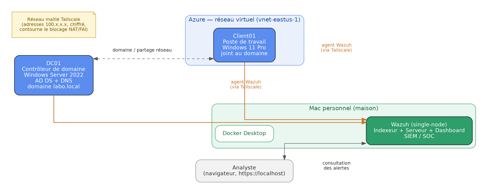

Vue d'ensemble du labo au complet : le domaine Active Directory tourne dans Azure (DC01 et Client01), pendant que le SIEM Wazuh, lui, est hébergé sur mon Mac personnel. Les trois machines se parlent grâce au réseau maillé Tailscale, qui règle le problème de connexion entre le cloud Azure et mon réseau à la maison.

## Architecture du labo

| Machine | Rôle | Détails |
|---|---|---|
| **DC01** | Contrôleur de domaine | Windows Server 2022 Datacenter, domaine `labo.local`, rôles AD DS + DNS |
| **Client01** | Poste de travail | Windows 11 Pro, joint au domaine `labo.local` |
| Réseau | `vnet-eastus-1` | Réseau virtuel Azure commun aux deux VM, NSG configuré |

## Cycle de vie d'un compte utilisateur

| Étape | Description |
|---|---|
| 1. Création | Je crée l'utilisateur dans l'OU de son département (TI, Ventes ou RH) |
| 2. Attribution de rôle | J'ajoute l'utilisateur au groupe de sécurité du département (`Gr-TI`, `Gr-Sales`, `Gr-RH`) |
| 3. Application des accès | Les permissions NTFS sont restreintes au groupe sur le dossier partagé correspondant (héritage désactivé, accès large par défaut retiré) |
| 4. Revue d'accès | Je teste en me connectant avec un compte : seul le dossier du bon groupe s'ouvre, les autres renvoient un accès refusé |
| 5. Désactivation *(à venir)* | Désactivation du compte au départ d'un employé, retrait automatique des accès liés à ses groupes |

## Active Directory : structure et stratégies de groupe

### Unités d'organisation, utilisateurs et groupes de sécurité

J'ai créé trois OU (TI, Ventes, RH), chacune avec deux utilisateurs et un groupe de sécurité de département. L'idée : gérer les accès par rôle, pas un par un.

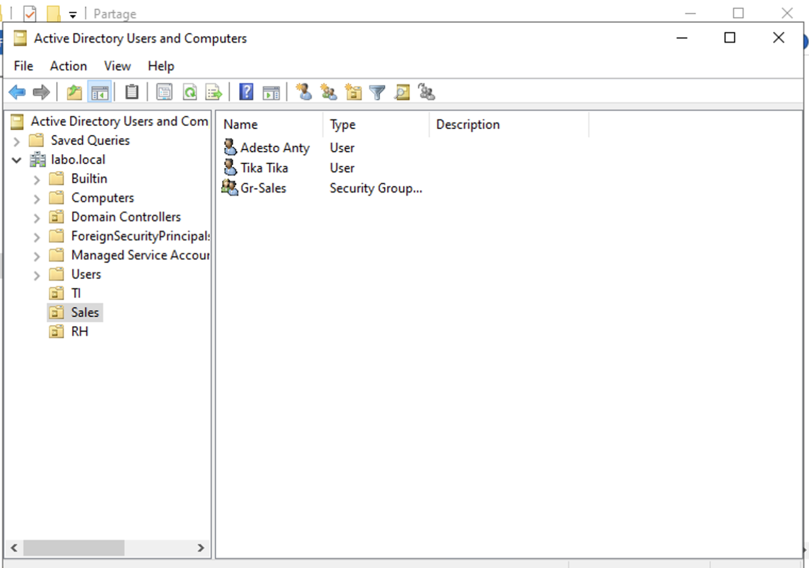

*Active Directory Users and Computers, structure des OU, utilisateurs et groupe de sécurité (exemple : OU Sales).* On voit ici l'OU Sales avec ses deux utilisateurs et le groupe Gr-Sales. J'ai reproduit exactement la même structure pour TI et RH.

### Stratégies de groupe (GPO)

J'ai configuré trois GPO pour renforcer la posture de sécurité du domaine :

- Refus d'accès aux périphériques de stockage amovible (clés USB), contre le vol de données et les clés infectées
- Verrouillage automatique de session après 300 secondes d'inactivité, pour éviter qu'une session reste ouverte sans surveillance
- Complexité des mots de passe (Default Domain Policy), pour forcer des mots de passe avec majuscules, minuscules, chiffres et caractères spéciaux

<table>
<tr>
<th>Restriction USB</th>
<th>Verrouillage automatique</th>
<th>Complexité des mots de passe</th>
</tr>
<tr>
<td>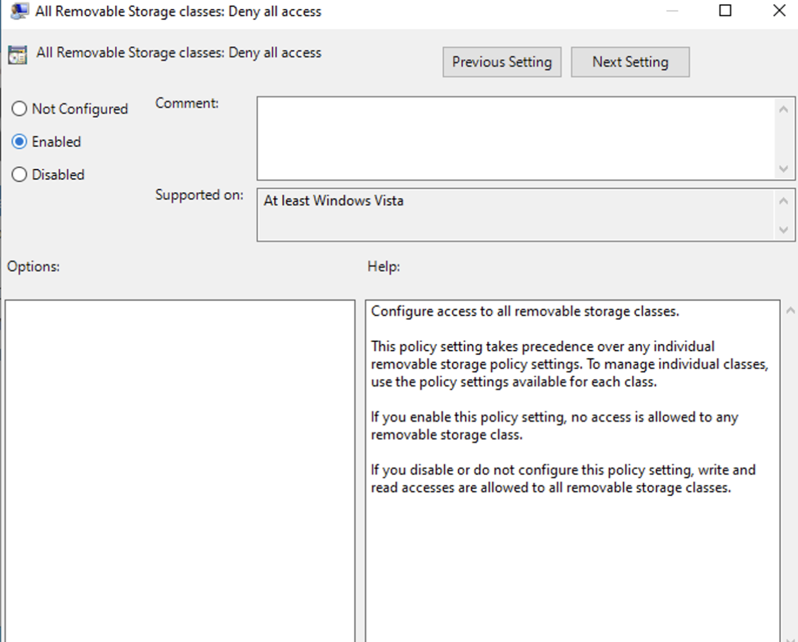</td>
<td>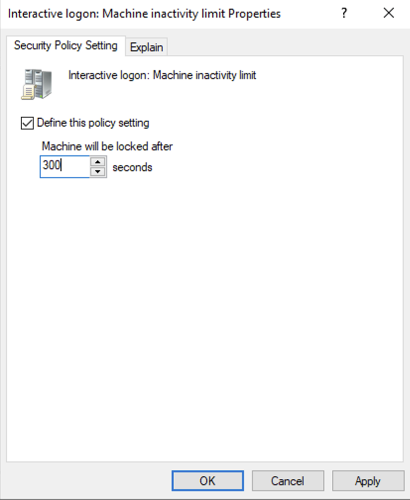</td>
<td>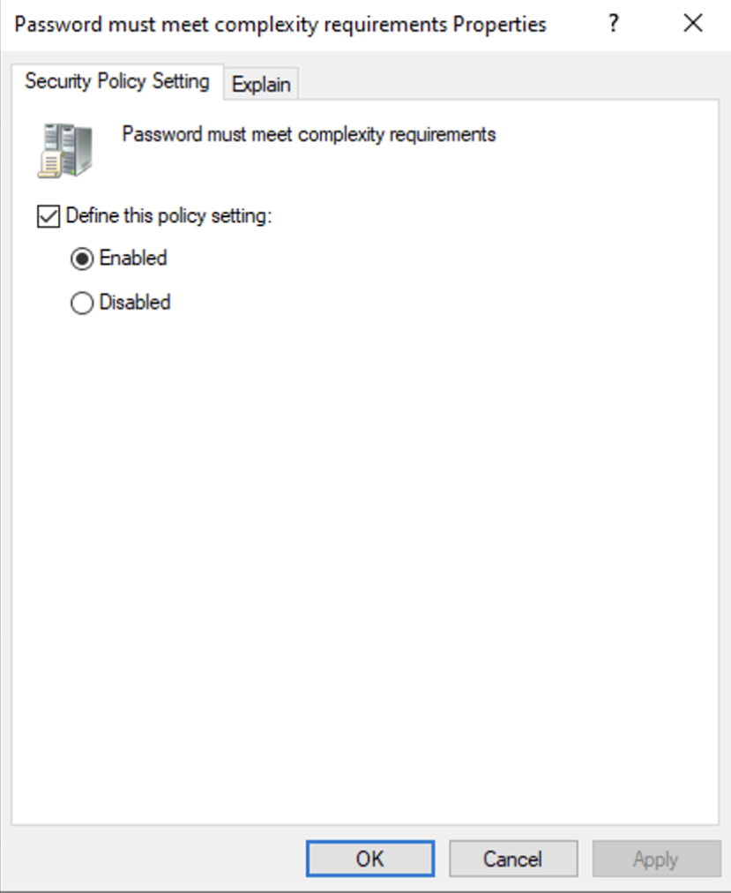</td>
</tr>
</table>

### Connexion du poste client avec un compte de domaine

Après avoir joint Client01 au domaine et autorisé le groupe `Gr-RH` à ouvrir une session à distance (Remote Desktop Users), j'ai testé la connexion avec succès.

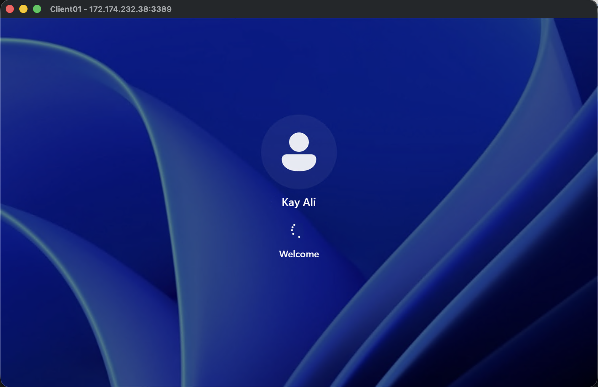

*Ouverture de session sur Client01 avec un compte de domaine (membre de Gr-RH).* Ce test confirme que Client01 reconnaît les comptes du domaine et que Gr-RH a les droits nécessaires pour ouvrir une session à distance sur cette machine.

## Principe du moindre privilège (RBAC) et test réseau

J'ai créé un dossier partagé sur DC01 avec un sous-dossier par département. Les permissions NTFS de chaque sous-dossier sont restreintes au groupe de sécurité correspondant.

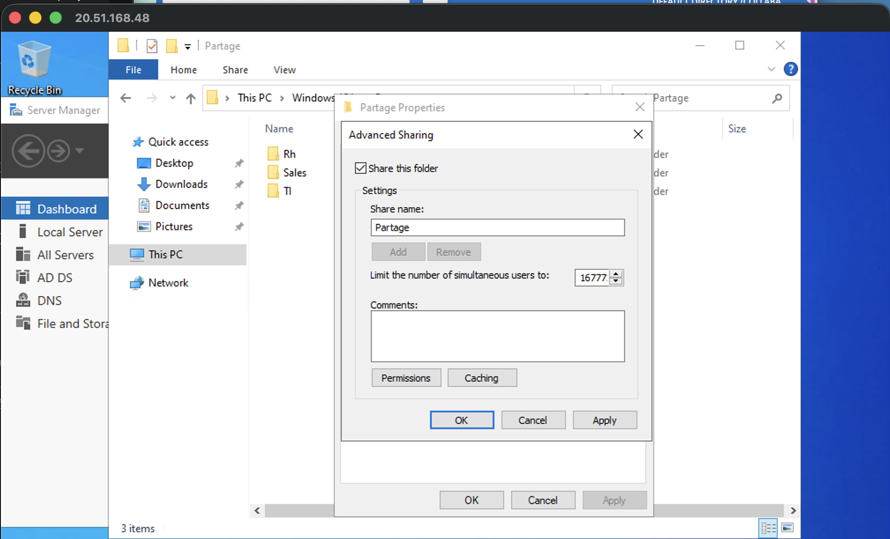

*Partage réseau « Partage » activé sur DC01 (onglet Sharing).*

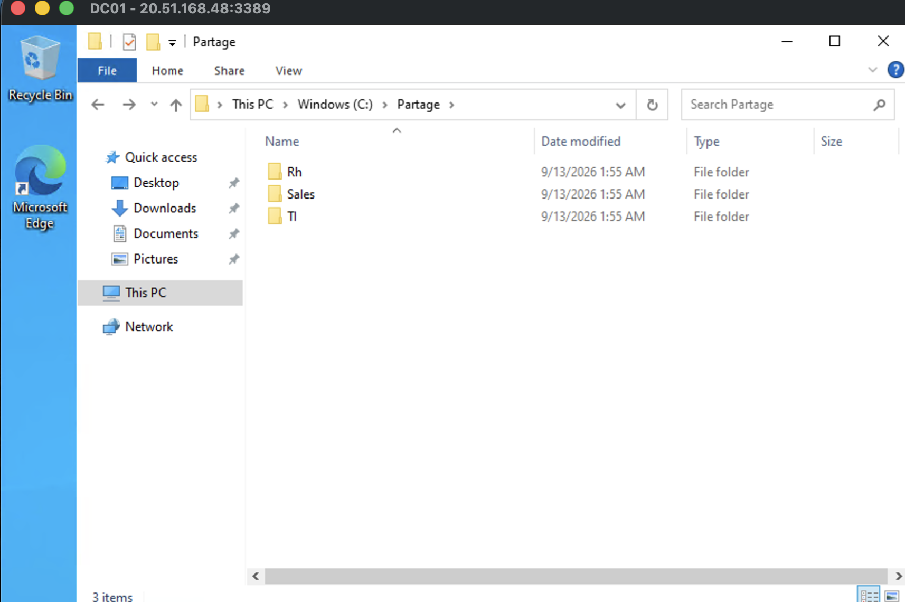

*Contenu du dossier partagé, un sous-dossier par département (Rh, Sales, TI). C'est sur ces trois sous-dossiers que j'ai ensuite appliqué des permissions différentes selon le groupe.*

### Tentative d'accès depuis Internet (Mac personnel)

J'ai d'abord ajouté une règle de pare-feu Azure (NSG) pour autoriser le trafic SMB (port 445) uniquement depuis mon adresse IP publique personnelle. La tentative de connexion depuis mon Mac a quand même échoué : la plupart des fournisseurs d'accès Internet résidentiels bloquent le port 445 en sortie pour des raisons de sécurité, peu importe ce qu'on configure côté Azure.

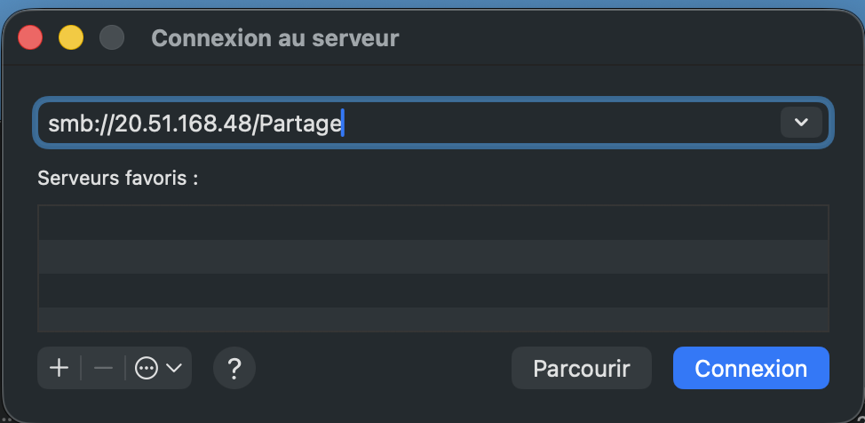

*Tentative de connexion SMB depuis le Mac personnel, bloquée en amont par le fournisseur Internet, pas par Azure.*

### Accès depuis le réseau interne (Client01)

Depuis Client01, sur le même réseau virtuel que DC01, l'accès au partage (`\\DC01\Partage`) fonctionne directement. Test décisif : avec un compte membre de `Gr-RH`, le dossier **Rh** s'ouvre normalement, tandis que **TI** et **Sales** renvoient un message *"Access is denied"*. Ça confirme que les permissions par groupe sont bien appliquées.

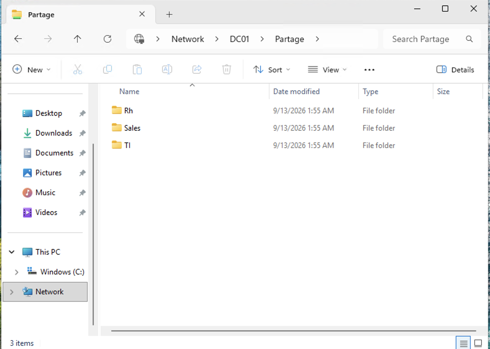

*Accès au partage réseau depuis Client01, sur le même réseau virtuel que DC01. C'est la preuve concrète que le principe du moindre privilège fonctionne : chaque groupe ne voit que ce qui le concerne.*

> C'est en fait une bonne chose que l'accès externe soit bloqué : dans une vraie entreprise, un partage de fichiers interne n'est jamais exposé directement sur Internet. Le test qui compte vraiment, c'est celui-ci, réussi depuis Client01, sur le réseau interne.

---

## Phase 2, surveillance SIEM (Wazuh)

Après la Phase 1, l'étape suivante, c'était d'ajouter un volet de surveillance de sécurité (SOC) en installant le SIEM open-source [Wazuh](https://wazuh.com/), pour montrer des compétences complémentaires à l'IAM : détection d'événements de sécurité, analyse d'alertes et rédaction d'un rapport d'investigation.

### Choix d'architecture : Docker sur mon Mac plutôt qu'une VM Azure

J'ai d'abord essayé de déployer Wazuh sur une nouvelle VM Ubuntu, dans le même réseau Azure que DC01 et Client01, mais j'ai abandonné : mon abonnement Azure refusait systématiquement toutes les tailles de VM que je testais (B2s, D2s_v7, et d'autres), pour des raisons de quota régional et d'incompatibilité de contrôleur de disque, même en ajustant la zone de disponibilité, le type de sécurité et la génération de l'image. J'ai donc choisi d'installer Wazuh en local via **Docker**, sur mon Mac (Apple Silicon M4) déjà utilisé pour Kali Linux, une approche tout aussi valide pour un labo personnel.

### Installation de Wazuh via Docker

J'ai installé et démarré Docker Desktop sur le Mac (confirmé via `docker --version`), puis cloné localement le dépôt officiel [`wazuh-docker`](https://github.com/wazuh/wazuh-docker) (version v4.14.7) pour un déploiement single-node.

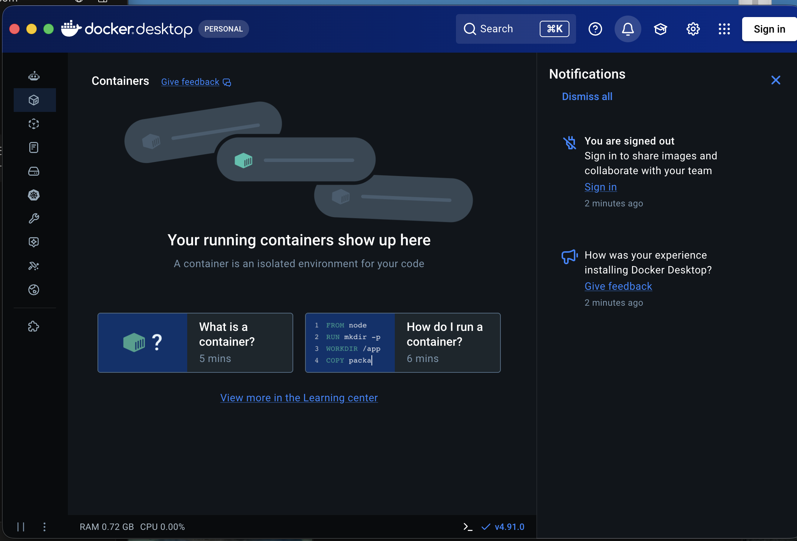

*Docker Desktop installé et démarré sur le Mac (moteur actif, version 4.91.0). Cette vérification de base confirme que le moteur tourne avant même de toucher à Wazuh.*

La génération des certificats SSL m'a donné une erreur de permissions connue sur macOS : le script de génération verrouille lui-même le dossier de destination en lecture seule une fois les certificats créés, ce qui empêchait la copie finale d'un des fichiers. J'ai confirmé le problème en inspectant les permissions (`ls -la`), puis je l'ai réglé en réappliquant temporairement les droits d'écriture, en copiant le certificat manquant, puis en remettant le dossier en lecture seule.

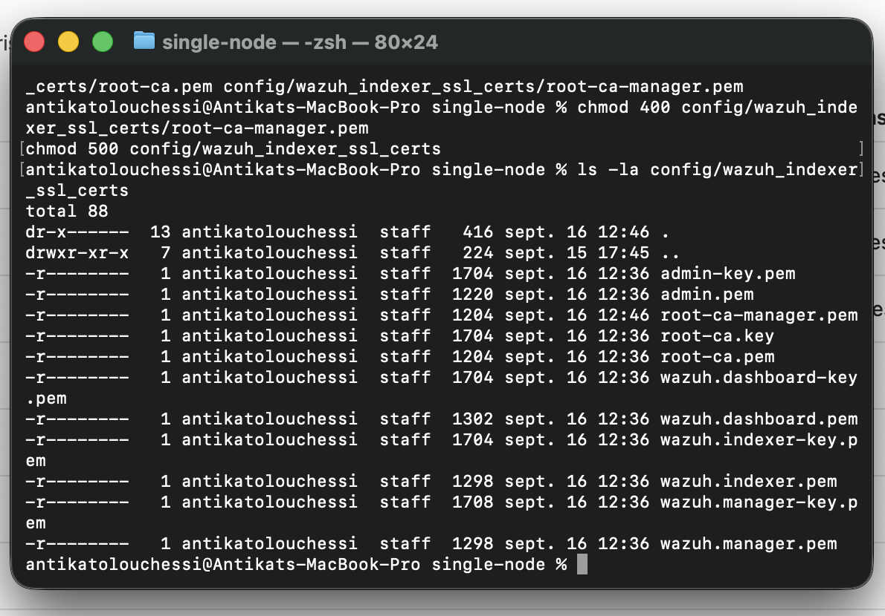

*Tous les certificats SSL générés avec succès, permissions restreintes en lecture seule. Ces certificats chiffrent les communications entre l'indexeur, le serveur et le tableau de bord Wazuh.*

Une fois les certificats en place, `docker compose up -d` a téléchargé les trois images Wazuh (indexeur, serveur, tableau de bord) et démarré les conteneurs correspondants.

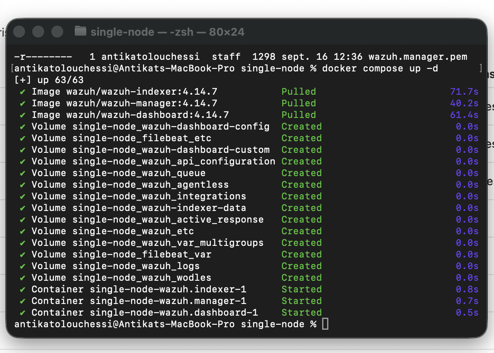

*Les trois images Wazuh sont téléchargées et les conteneurs démarrent sans erreur.*

### Accès au tableau de bord Wazuh

Le tableau de bord est accessible à `https://localhost`. L'avertissement de certificat du navigateur est normal (certificat auto-signé, pas une vraie alerte de sécurité dans ce contexte de labo local).

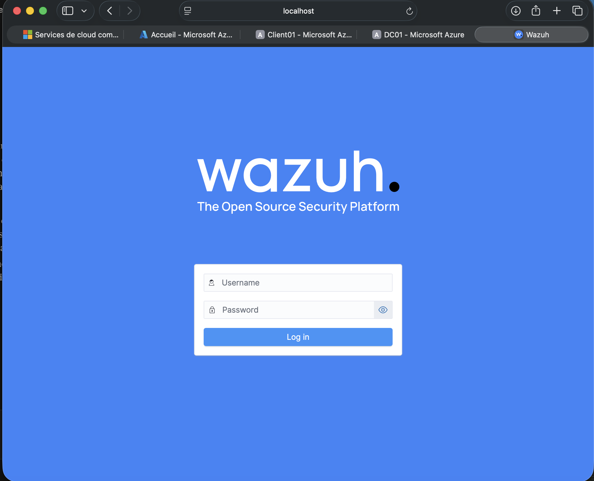

*Écran de connexion du tableau de bord Wazuh. Le simple fait que cet écran apparaisse confirme que toute la pile communique correctement entre elle.*

### Connectivité réseau : Tailscale

DC01 et Client01 sont hébergées dans Azure, alors que mon serveur Wazuh tourne sur le Mac à la maison. Les agents ne pouvaient donc pas atteindre le Mac directement, le fournisseur Internet résidentiel bloque les connexions entrantes, comme lors du test SMB de la Phase 1. J'ai installé le réseau maillé [Tailscale](https://tailscale.com/) sur les trois machines pour leur donner des adresses IP privées communes, joignables entre elles peu importe leur réseau physique. Sur DC01, comme je n'avais pas d'identifiants pour l'authentification interactive, j'ai généré une clé d'authentification depuis le Mac et je l'ai utilisée pour connecter DC01 et Client01 sans navigateur.

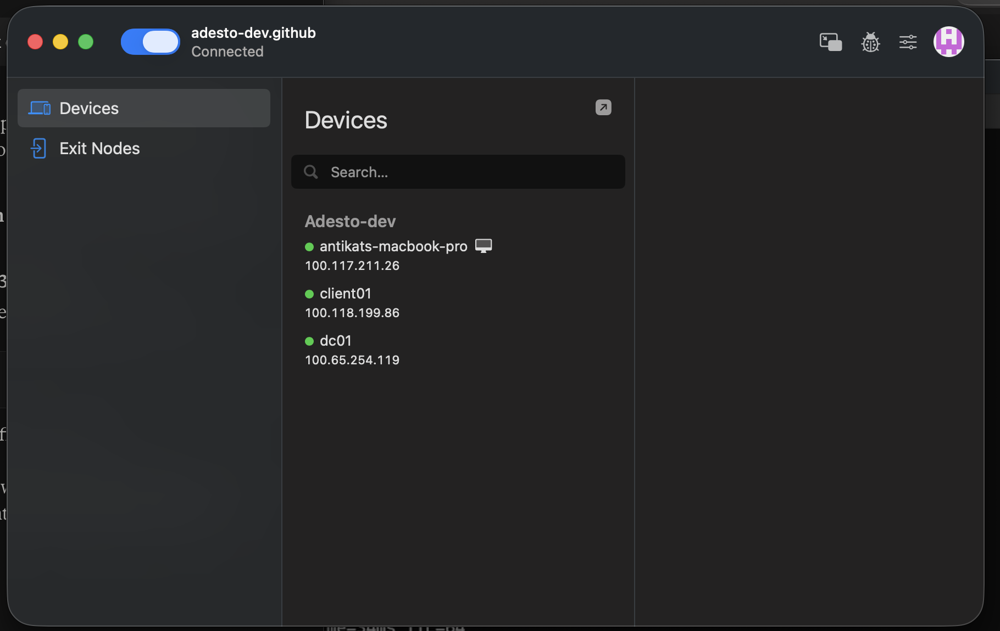

*Les trois appareils (Mac, DC01, Client01) connectés au même réseau Tailscale, chacun avec sa propre adresse (plage 100.x.x.x). Cette vue confirme qu'ils sont bien sur le même réseau virtuel malgré leurs emplacements physiques différents.*

### Déploiement des agents Wazuh

J'ai déployé un agent Wazuh sur DC01 puis sur Client01 via l'assistant « Deploy new agent » (système Windows, adresse du serveur = adresse Tailscale du Mac), en exécutant la commande PowerShell générée sur chaque machine.

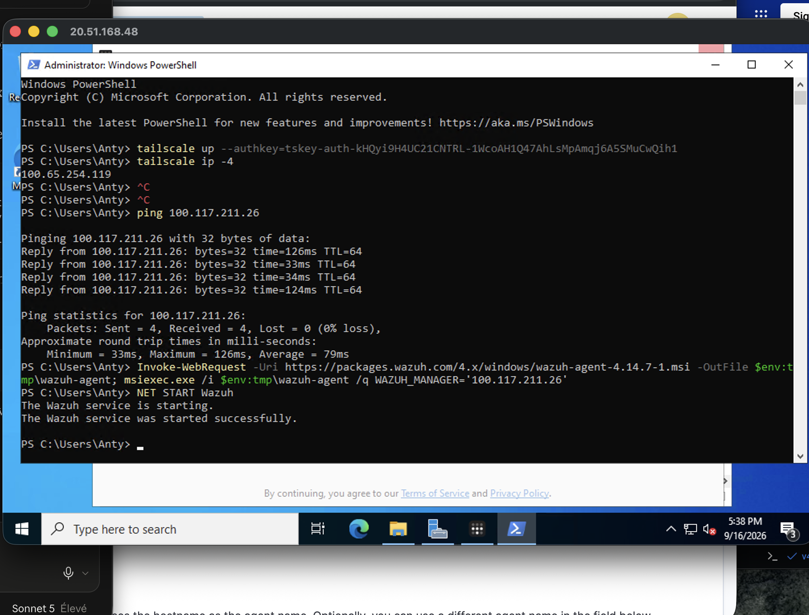

*Installation et démarrage réussis de l'agent Wazuh sur DC01.*

Les deux agents apparaissent maintenant avec le statut **Active** dans le tableau de bord. Le SIEM surveille en temps réel les deux machines Windows du labo.

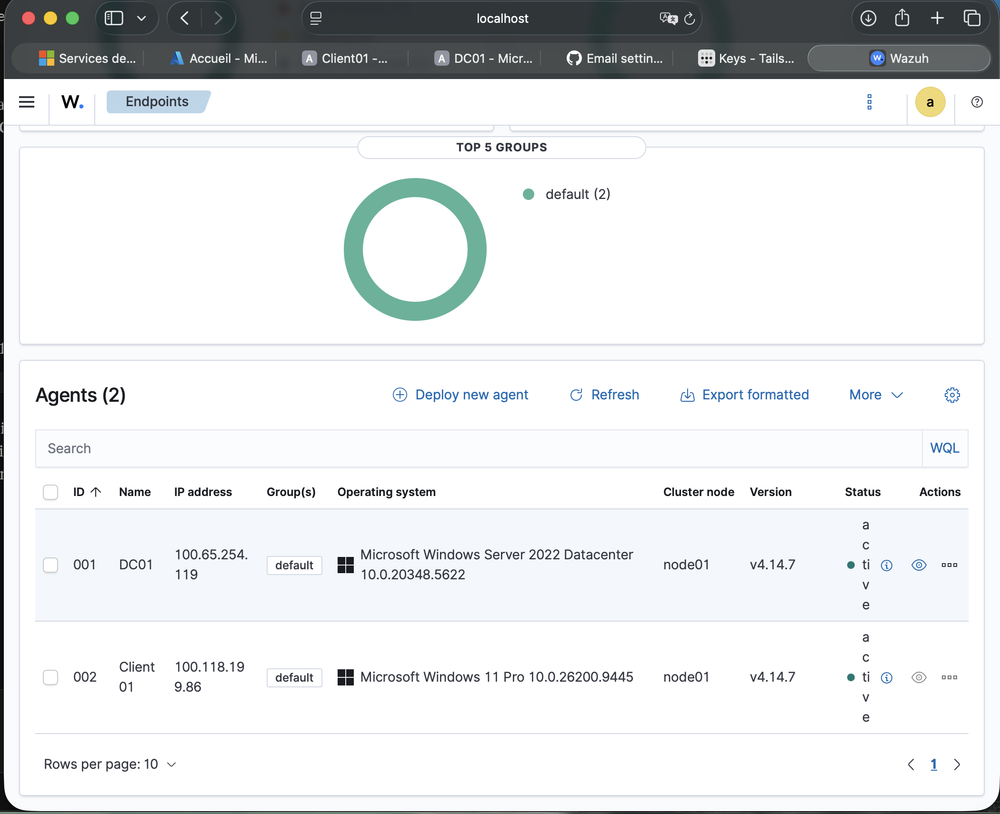

*DC01 et Client01 sont actifs dans le tableau de bord Wazuh. C'est le résultat clé de cette section : mon SIEM reçoit maintenant les journaux d'événements des deux machines en temps réel.*

### Simulation d'attaque et investigation

J'ai simulé volontairement une attaque par force brute sur Client01 (six tentatives de connexion avec un mauvais mot de passe). Wazuh a détecté et journalisé les six tentatives (règle `60122`, *Logon Failure - Unknown user or bad password*, niveau 5) en une quinzaine de secondes.

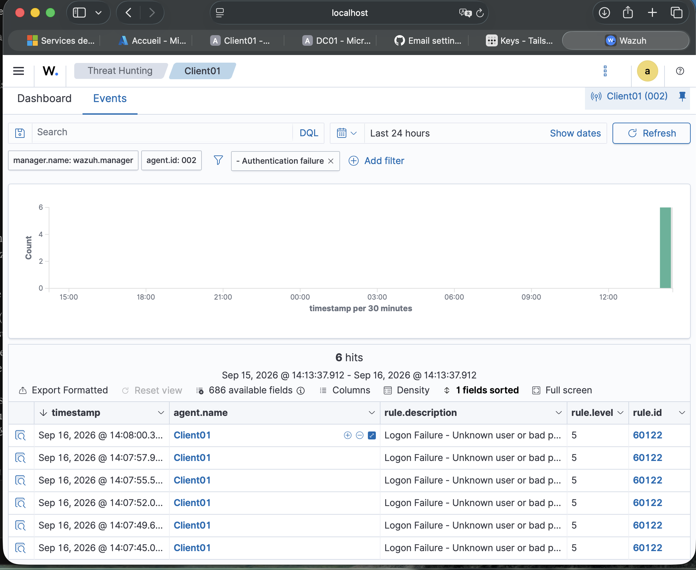

*Les 6 tentatives échouées détectées par Wazuh sur Client01, toutes regroupées sur une fenêtre de 15 secondes, un pattern de force brute facile à repérer.*

J'ai fait l'analyse complète de cet incident (chronologie, détails techniques, évaluation du risque et recommandations) dans un rapport séparé : **[Rapport-Investigation-Force-Brute-Client01.docx](Rapport-Investigation-Force-Brute-Client01.docx)**.

### Prochaines étapes

- [ ] Changer le mot de passe par défaut du tableau de bord Wazuh
- [ ] Mettre en place une règle de corrélation Wazuh pour élever la sévérité des échecs d'authentification répétés
- [ ] Ajouter une stratégie de verrouillage de compte (Account Lockout Policy) via GPO
- [ ] Révoquer les clés d'authentification Tailscale temporaires une fois le labo terminé

---

*Projet personnel d'Antikat Olouchessi, certificat en cybersécurité, Polytechnique Montréal.*
